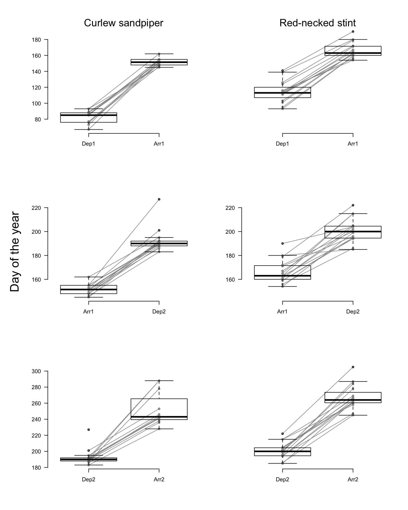

# Phenology {#phen}

(\#fig:unnamed-chunk-1)Figure 1: Departure and arrival dates of tracked Curlew sandpipers (left) and Red-necked stints (right). Dep1 = departure at tag deployment site; Arr1 = arrival at breeding site; Dep2 = departure from breeding site; Arr2 = arrival at tag deployment site.

