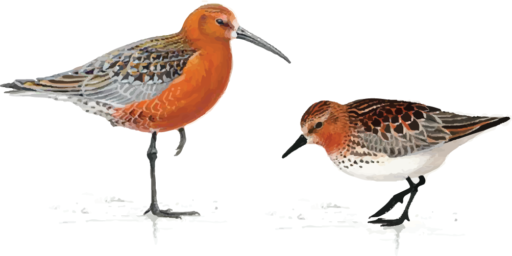

--- 
title: "Migration pattern and consequences of Curlew Sandpipers and Red-necked stints in the EAAF"
date: "Last edited on 2020-03-24"
site: bookdown::bookdown_site
output: bookdown::gitbook
documentclass: book
biblio-style: apalike
link-citations: yes
github-repo: slisovski/CurlewSands_RedNStints
description: "Migration along the East Asian-Australasian Flyway"
---

# Abstract

...

## Authors {-}
Simeon Lisovski^1^, Ken Gosbell^2^, Clive Minton^2^*, ..., Marcel Klaassen^3^

^1^ Alfred-Wegener-Institute Helmholz Centre for Marine and Polar Research, Potsdam, Germany. ^2^ Victorian Wader Study Group, Australia. ^3^ Deakin University, Centre for Integrative Ecology, Geelong, Australia. * Deceased. \

